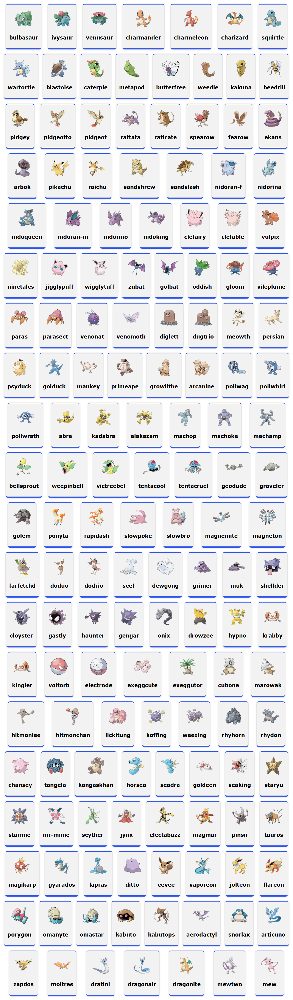

# Pokedex


#### Pokedex 


## Introdução

O projeto **Pokedex** é uma aplicação Angular que permite aos usuários visualizar uma lista de Pokémon utilizando a [PokéAPI](https://pokeapi.co/). O objetivo deste projeto é aprender a criar uma aplicação web interativa usando Angular, componentes e serviços, além de integrar uma API externa para obter dados dinâmicos.

## Tecnologias Utilizadas

- **Angular**: Framework para construção de aplicações web.
- **TypeScript**: Linguagem de programação que superset de JavaScript.
- **HTML/CSS**: Linguagens para estruturação e estilização de páginas web.
- **PokéAPI**: API RESTful que fornece dados sobre Pokémon.

## Menu

- [Introdução](#introdução)
- [Tecnologias Utilizadas](#tecnologias-utilizadas)
- [Pré-requisitos](#pré-requisitos)
- [Passo a Passo para Criar o Projeto](#passo-a-passo-para-criar-o-projeto)
  - [Passo 1: Criar o Projeto](#passo-1-criar-o-projeto)
  - [Passo 2: Configurar o `tsconfig.json`](#passo-2-configurar-o-tsconfigjson)
  - [Passo 3: Criar Componentes e Serviço](#passo-3-criar-componentes-e-serviço)
  - [Passo 4: Configurar o Componente Pokemon Card](#passo-4-configurar-o-componente-pokemon-card)
  - [Passo 5: Configurar o Componente Pokemon List](#passo-5-configurar-o-componente-pokemon-list)
  - [Passo 6: Configurar o Serviço Pokemon](#passo-6-configurar-o-serviço-pokemon)
  - [Passo 7: Configurar o Componente Principal](#passo-7-configurar-o-componente-principal)
  - [Passo 8: Criar o Modelo de Pokemon](#passo-8-criar-o-modelo-de-pokemon)
- [Explicação sobre o `HttpClientModule`](#explicação-sobre-o-httpclientmodule)
- [Finalizando](#finalizando)
- [Como Contribuir](#como-contribuir)
- [Como Clonar o Projeto](#como-clonar-o-projeto)

## Pré-requisitos

Antes de começar, você precisará ter o seguinte instalado em sua máquina:

- [Node.js](https://nodejs.org/) (inclui npm)
- Angular CLI: instale globalmente utilizando o comando:
  ```bash
  npm install -g @angular/cli
  

## Passo a Passo para Criar o Projeto

### Passo 1: Criar o Projeto

Dentro da pasta onde você deseja criar seu projeto, execute o seguinte comando no terminal para criar um novo projeto Angular:

```bash
ng new angular-pokedex
```

Depois, navegue até a pasta do projeto:

```bash
cd angular-pokedex
```

### Passo 2: Configurar o `tsconfig.json`

Com a versão 14 do Angular, algumas configurações do TypeScript precisam ser ajustadas. Abra o arquivo `tsconfig.json` e faça as seguintes alterações:

```json
{
  "compileOnSave": false,
  "compilerOptions": {
    "baseUrl": "./",
    "outDir": "./dist/out-tsc",
    "forceConsistentCasingInFileNames": true,
    "strict": true,
    "noImplicitOverride": true,
    "noPropertyAccessFromIndexSignature": true,
    "noImplicitReturns": true,
    "noFallthroughCasesInSwitch": true,
    "sourceMap": true,
    "declaration": false,
    "downlevelIteration": true,
    "experimentalDecorators": true,
    "moduleResolution": "node",
    "importHelpers": true,
    "target": "es2020",
    "module": "es2020",
    "lib": [
      "es2020",
      "dom"
    ],
    "skipLibCheck": true
  },
  "angularCompilerOptions": {
    "enableI18nLegacyMessageIdFormat": false,
    "strictInjectionParameters": true,
    "strictInputAccessModifiers": true,
    "strictTemplates": true
  }
}
```

#### Explicação das Configurações
- **`skipLibCheck`**: Ignora a verificação dos arquivos de declaração de biblioteca, o que pode acelerar a compilação e evitar erros desnecessários.

### Passo 3: Criar Componentes e Serviço

Agora, vamos criar os componentes e o serviço necessários. Execute os seguintes comandos no terminal:

#### Criando os Componentes

```bash
ng g c pokemon-card
ng g c pokemon-list
```

#### Criando o Serviço

```bash
ng g s pokemon-service
```

### Passo 4: Configurar o Componente Pokemon Card

#### Arquivo `pokemon-card.component.html`

```html
<div class="pokemon-card">
    
    <h2>{{ pokemon }}</h2>
</div>
```

#### Arquivo `pokemon-card.component.sass`

```sass
.pokemon-card
  font-family: "Verdana", sans-serif
  background: #f2f2f2
  border: 1px solid #c5c5c5
  padding: 15px
  margin: 10px
  border-radius: 10px
  box-shadow: 0 1px 6px rgba(32, 33, 36, 0.28)
  border-color: rgba(223, 225, 229, 0)
  border-top: 3px solid #3359ec
  border-bottom: 6px solid #3359ec

  display: inline-block
  text-align: center

  img
    width: 100px
    height: auto
```

#### Arquivo `pokemon-card.component.ts`

```typescript
import { Component, Input } from '@angular/core';

@Component({
  selector: 'app-pokemon-card',
  templateUrl: './pokemon-card.component.html',
  styleUrls: ['./pokemon-card.component.sass']
})
export class PokemonCardComponent {
  @Input() pokemon: string | undefined; // Pokémon é opcional
  @Input() numero: number | undefined; // Número é opcional

  // Método para pegar a imagem do Pokémon
  pegarImagemPokemon(): string {
    const numeroFormatado = this.leadingZero(this.numero ?? 0);
    return `https://www.pokemon.com/static-assets/content-assets/cms2/img/pokedex/detail/${numeroFormatado}.png`;
  }
  
  // Método para formatar o número com zeros à esquerda
  private leadingZero(value: number | undefined, size = 3): string {
    if (value === undefined) {
      return '000'; // Valor padrão se undefined
    }
    return String(value).padStart(size, '0'); // Formata o número
  }
}
```

### Passo 5: Configurar o Componente Pokemon List

#### Arquivo `pokemon-list.component.html`

```html
<div class="pokemon-list">
    <app-pokemon-card *ngFor="let pokemon of pokemonService.pokemons; index as i" [pokemon]="pokemon.name"
        [numero]="i + 1">
    </app-pokemon-card>
</div>
```

#### Arquivo `pokemon-list.component.sass`

```sass
.pokemon-list
  display: flex
  flex-direction: row
  flex-wrap: wrap
  justify-content: space-evenly
```

#### Arquivo `pokemon-list.component.ts`

```typescript
import { Component } from '@angular/core';
import { PokemonService } from '../service/pokemon.service';

@Component({
  selector: 'app-pokemon-list',
  templateUrl: './pokemon-list.component.html',
  styleUrls: ['./pokemon-list.component.sass']
})
export class PokemonListComponent {
  constructor(public pokemonService: PokemonService) {}
}
```

### Passo 6: Configurar o Serviço Pokemon

#### Arquivo `pokemon.service.ts`

```typescript
import { HttpClient } from '@angular/common/http'; 
import { Injectable } from '@angular/core';

@Injectable({
  providedIn: 'root'
})
export class PokemonService {
  pokemons: any[] = []; // Armazenar detalhes dos Pokémon

  constructor(private httpClient: HttpClient) {
    this.carregarPokemons();
  }

  async carregarPokemons() {
    try {
      const requisicao = await this.httpClient.get<any>('https://pokeapi.co/api/v2/pokemon?limit=151').toPromise();

      // Para cada Pokémon, busque seus detalhes
      const pokemonRequests = requisicao.results.map((pokemon: any) =>
        this.httpClient.get<any>(pokemon.url).toPromise()
      );

      // Aguardar todas as requisições dos Pokémon serem resolvidas
      this.pokemons = await Promise.all(pokemonRequests);
      
      // Log para verificar os dados carregados
      console.log(this.pokemons);
    } catch (error) {
      console.error('Erro ao carregar pokémons:', error); // Log de erro caso a requisição falhe
    }
  }
}
```

### Passo 7: Configurar o

 Componente Principal

#### Arquivo `app.component.html`

```html
<h1>Pokedex</h1>
<app-pokemon-list></app-pokemon-list>
```

### Passo 8: Criar o Modelo de Pokemon

Você pode criar um modelo para representar os dados do Pokémon, mas, neste exemplo, vamos utilizar a interface da API diretamente. Se você preferir, pode criar uma interface `Pokemon` com as propriedades desejadas.

## Explicação sobre o `HttpClientModule`

Para usar o `HttpClient` em seu serviço, você precisará importar o `HttpClientModule` no seu `app.module.ts`:

```typescript
import { BrowserModule } from '@angular/platform-browser';
import { NgModule } from '@angular/core';
import { HttpClientModule } from '@angular/common/http'; // Importando HttpClientModule

import { AppComponent } from './app.component';
import { PokemonListComponent } from './pokemon-list/pokemon-list.component';
import { PokemonCardComponent } from './pokemon-card/pokemon-card.component';

@NgModule({
  declarations: [
    AppComponent,
    PokemonListComponent,
    PokemonCardComponent
  ],
  imports: [
    BrowserModule,
    HttpClientModule // Adicionando HttpClientModule aos imports
  ],
  providers: [],
  bootstrap: [AppComponent]
})
export class AppModule { }
```

## Finalizando

Para rodar a aplicação, execute o seguinte comando no terminal:

```bash
ng serve
```

Acesse `http://localhost:4200/` no seu navegador para visualizar a Pokedex.

## Como Contribuir

Contribuições são sempre bem-vindas! Para contribuir com este projeto, siga as etapas abaixo:

1. **Faça um Fork do Projeto**
   - Vá até a página do repositório no GitHub.
   - Clique no botão "Fork" no canto superior direito da página.
   - Isso criará uma cópia do projeto no seu perfil do GitHub.

2. **Clone o Fork em Sua Máquina Local**
   - Abra seu terminal.
   - Use o comando abaixo para clonar o repositório para sua máquina:
     ```bash
     git clone https://github.com/seu-usuario/angular-pokedex.git
     ```
     (Substitua `seu-usuario` pelo seu nome de usuário do GitHub.)

3. **Navegue até o Diretório do Projeto**
   - Entre no diretório do projeto clonado:
     ```bash
     cd angular-pokedex
     ```

4. **Crie uma Nova Branch para Suas Alterações**
   - Antes de fazer alterações, crie uma nova branch. Isso é importante para manter as alterações organizadas e separadas da branch principal (`main` ou `master`):
     ```bash
     git checkout -b minha-nova-feature
     ```
     (Substitua `minha-nova-feature` por um nome descritivo para a sua feature ou correção.)

5. **Faça Suas Alterações**
   - Abra os arquivos que deseja modificar no seu editor de código.
   - Faça as alterações necessárias.

6. **Adicione as Alterações ao Staging**
   - Após fazer suas alterações, adicione os arquivos modificados ao staging com o comando:
     ```bash
     git add .
     ```
     (O `.` adiciona todos os arquivos modificados. Você pode também adicionar arquivos específicos usando `git add nome-do-arquivo`.)

7. **Faça um Commit das Suas Alterações**
   - Agora, faça um commit das suas alterações com uma mensagem clara:
     ```bash
     git commit -m 'Adicionando nova feature'
     ```

8. **Envie as Alterações para o Seu Fork**
   - Após o commit, envie suas alterações para o repositório remoto:
     ```bash
     git push origin minha-nova-feature
     ```

9. **Abra um Pull Request**
   - Vá para a página do seu fork no GitHub.
   - Clique no botão "Compare & pull request" que aparecerá após você enviar sua branch.
   - Preencha as informações sobre suas alterações e clique em "Create pull request".

## Como Clonar o Projeto

Para clonar o projeto em sua máquina local, use o seguinte comando:

```bash
git clone https://github.com/seu-usuario/angular-pokedex.git
```

- **Substitua `seu-usuario`** pelo seu nome de usuário do GitHub.
- Após clonar, você terá uma cópia completa do repositório em seu sistema local, e você poderá fazer alterações, testar o projeto ou até mesmo contribuir com novas funcionalidades.

---

Sinta-se à vontade para modificar as instruções conforme necessário para melhor atender às suas necessidades e à sua equipe! 
